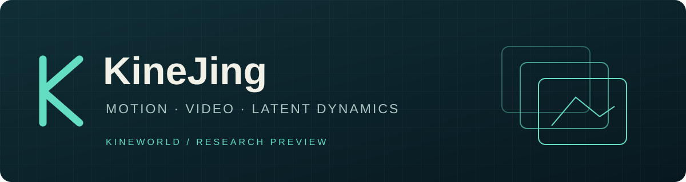
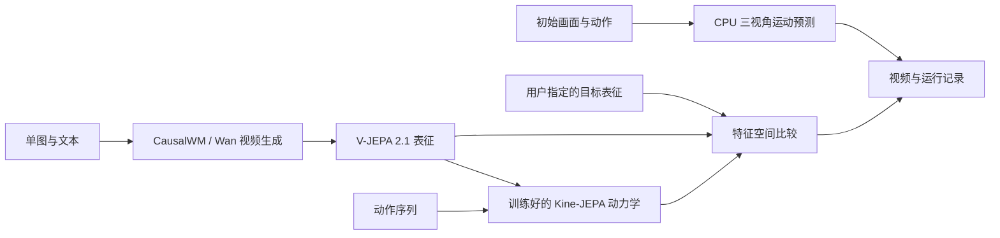
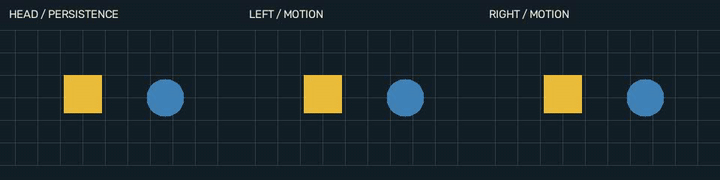

<p align="center"></p>

<h1 align="center">KineJing · 勘境</h1>
<p align="center"><b>连接运动、几何、视频与动作，构建可验证的世界模型工作流。</b></p>
<p align="center">
  <a href="https://github.com/kineworld/KineJing/actions/workflows/tests.yml"></a>
  <a href="LICENSE"></a>
  
</p>
<p align="center"><a href="#quickstart">快速开始</a> · <a href="#components">组件</a> · <a href="docs/INTEGRATION.md">集成指南</a> · <a href="evidence/README.md">实验记录</a> · <a href="NOTICE.md">来源与许可</a></p>

KineJing 是 [KineWorld](https://github.com/kineworld) 的世界模型集成研究项目。
它把本地可运行的三视角运动预测基线，与 CausalWM、Wan 2.2、V-JEPA 2.1 和
KineWorld 潜在动力学代码连接到统一的命令与工件接口。

当前已有 **CPU 基线、真实 DINOv2 权重推理、训练完成的三视角动作条件特征预测器，以及外部生成模型适配器**。
新预测器的训练、分组评估和权重哈希见[模型卡](docs/DYNAMICS_MODEL_CARD.md)。它输出未来特征，不生成 RGB 视频；不是新训练的基础大模型。
CausalWM / Wan / V-JEPA 的完整权重推理、联合训练和端到端组合效果仍未验证，没有官方榜单分数。

另有直接基于上游代码修改的 [KineJing-CausalWM](https://github.com/kineworld/KineJing-CausalWM)：
增加可选的分块 VAE 解码及逐块转移到 CPU，保留上游来源与许可证；完整模型显存与画质尚未实测。

### 工作流



不同模块在表示、输出和验证流程上组合，不对不兼容的模型权重做平均。
`kine-jepa` 的动作预测需要在对应表征空间训练的检查点；适配器拒绝无权重或表征不匹配的输入。
`pack-actions` 连接编码器输出与动作序列，严格核对动作列名、单位、坐标系与训练归一化约定，避免把不同动作协议直接接到一起。

<a id="quickstart"></a>
## 快速开始

```bash
git clone https://github.com/kineworld/KineJing.git
cd KineJing
python -m pip install -e .
python -m kinejing catalog
python -m kinejing demo --output runs/demo
python -m unittest discover -s tests -v
```

CPU 示例无需 API、模型下载或 GPU。基础包支持 Python 3.8+；可选神经网络适配器请使用
Python 3.10+，并按各上游项目单独安装依赖。生成正式 H.264 视频还需要 FFmpeg。

<p align="center"></p>
<p align="center"><sub>合成数据上的软件演示；非大模型输出、非比赛效果展示。</sub></p>

<a id="components"></a>
## 组件与当前状态

| 组件 | 用途 | 本仓库验证到的程度 |
|---|---|---|
| KineJing Motion | 动作条件检索、共享时间对齐、双腕运动迁移 | CPU 运行、局部验证、完整结果格式校验 |
| [KineJing Dynamics](docs/DYNAMICS_MODEL_CARD.md) + [DINOv2](https://github.com/facebookresearch/dinov2) | 冻结预训练视觉特征＋勘境训练的三视角动作预测 | 已训练、独立加载并推理；公开开发集分组评估；无 RGB 解码器 |
| [CausalWM](https://github.com/AetherLabsAI/CausalWM) | 单图＋文本生成 flow → pointmap → RGB | 参数构造与失败门禁测试；真实权重未运行 |
| [Wan 2.2](https://github.com/Wan-Video/Wan2.2) | TI2V-5B 视频生成备选路径 | 参数构造测试；真实权重未运行 |
| [V-JEPA 2.1](https://github.com/facebookresearch/vjepa2) | 冻结视频特征 | 本地权重适配代码；真实权重未运行 |
| [Kine-JEPA](https://github.com/kineworld/kine-jepa) | 指定特征空间中的动作条件预测 | 输入与权重协议；需要训练好的兼容检查点 |

所有上游版本固定在 [`backends.json`](kinejing/backends.json)。现阶段适配代码不等于
端到端能力验证；代码测试不等于模型效果测试。Jev 的付费托管 API 未接入。

## 调用外部模型

准备固定版本的仓库、上游依赖和本地权重，然后编辑配置中的路径与 Python 解释器：

```bash
python -m kinejing launch --config examples/causalwm.json --dry-run
python -m kinejing launch --config examples/causalwm.json
python -m kinejing launch --config examples/vjepa21.json
python -m kinejing rank --goal data/goal-features.npz --candidates runs/causalwm-features.npz
```

支持的配置见 [`examples/`](examples/)，各模块的输入、硬件条件及接线方式见
[`docs/INTEGRATION.md`](docs/INTEGRATION.md)。特征余弦相似度仅用于研究比较，不是 TWB-Score。
本项目没有验证大型生成模型能在 12GB 显存上运行。

## TriWorldBench 基线

使用官方公开验证集作为示例库。所有预测的 RGB 来自测试输入首帧：
共享 donor 与时间对齐，双腕使用相似变换及最多两像素的局部校正，头部保持首帧。
该方法不生成新的可见区域、物体接触或任务完成状态。

```bash
python -m kinejing triworld --dataset data/test_dataset --validation data/validation --report examples/motion.json --output runs/KineJing --manifest runs/manifest.json --workers 4 --crf 30 --preset slow
```

从[官方仓库](https://github.com/TriWorldBench/TriWorldBench)获取 `submission_check.py` 后再校验打包。
检查器会替换其输出目录，应使用专用的新目录。数据、权重和提交视频不随本仓库分发。

我们保留正面与负面实验记录；详见[机器可核对的证据表](evidence/README.md)。
当前没有官方 KineJing 分数，不能把上游论文成绩当作本项目成绩。

## 来源与许可

KineWorld 编写的集成层和 CPU 基线使用 MIT 许可。上游项目保留各自作者、许可证和模型条款，
详情见 [NOTICE.md](NOTICE.md)。这些引用不表示上游作者背书或合作关系。

欢迎提交复现记录、失败案例与兼容性修复。组织贡献规则见
[KineWorld CONTRIBUTING](https://github.com/kineworld/.github/blob/main/CONTRIBUTING.md)。
